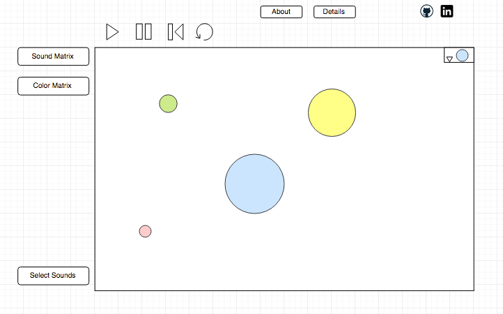

## StochAsteroids - An audio experience

### Background and Overview

StochAsteroids is a generative music tool combining the physics and visual impact of the classic Asteroids game with Markov chain state evolutions.

Markov chains are a mathematical construct that probabilistically govern the evolution of an object based on its previous state.

Users create an initial state comprising asteroids of differing sizes, velocities, and colors. As the simulation runs, every collision will result in a sound and visual event.

Additionally, users are able to define:
* A Markov matrix that governs the nature of the sound event based on the color state of the colliding objects.
* A Markov matrix that governs the evolution of color state of the colliding objects.

Pitch is determined inversely as the difference in velocities of the colliding objects.
Duration is determined as the difference in mass of the colliding objects.

### Functionality & MVP  

In StochAsteroids, users will be able to:

- [ ] Create asteroids of custom size, color, and velocity vector
- [ ] Alter the Markov matrix governing sound events
- [ ] Alter the Markov matrix governing color state evolutions
- [ ] Randomly seed the initial state for demoing or exploration purposes
- [ ] Start, pause, restart, and reset the simulation
- [ ] Select from a list of 'instruments' that will serve as the bases for sound events.

In addition, this project will include:

- [ ] An About modal describing the basic functionality
- [ ] A Details modal delving into the specific implementation of Markov chains

### Wireframes

This app will consist of a single screen with the simulation canvas, playback controls, probabilities controls, instrument selectors and nav links to the Github, my LinkedIn, and the About and Details modals.  

The simulation canvas will include a dropdown for selecting the initial color of the creation object. Users will click and drag to create objects of a certain size and vector angle.

Playback controls along the top will include Start, Pause, Restart and Reset buttons.

On the left, there will be an expandable menu allowing the user to control the sound event transition matrix and the color evolution matrix.

On the left near the bottom, will be an expandable menu allowing users to select the 'instruments'.

### Architecture and Technologies

This project will be implemented with the following technologies:

- Vanilla JavaScript for overall structure and game logic,
- `Easel.js` (maybe) with `HTML5 Canvas` for DOM manipulation and rendering,
- `Web Audio API` for sound generation, processing and control.
- Webpack to bundle and serve up the various scripts.

In addition to the webpack entry file, there will be four scripts involved in this project:

`board.js`: this script will handle the logic for creating and updating the necessary `Easel.js` elements and rendering them to the DOM.

`asteroids.js`: this script will house the physics logic for the asteroids.

`audio.js`: this script will handle the audio logic and the creation of `AudioEvent`s based on the input parameters outlined above. The programming paradigm will be an audio graph consisting of buffers and processing nodes, all connected into a master bus, and referencing a global AudioContext with its own timeline.

`evolutions.js`: this lightweight script will house the constructor and update functions for the `Evolutions` objects.  

### Implementation Timeline

**Day 1**: Setup all necessary Node modules, including getting webpack up and running and `Easel.js` installed.  Create `webpack.config.js` as well as `package.json`.  Write a basic entry file and the bare bones of all 4 scripts outlined above.  Learn the basics of `Easel.js` and `Web Audio API`.  Goals for the day:

- ~~Get a green bundle with `webpack`~~ **DONE**
- Learn enough `Easel.js` and `Web Audio` to render an object to the `Canvas` element and create a sound
- ~~Port over the relevant pieces of my Asteroids(with collision physics) project and implement Asteroid creation~~ **DONE**

**Day 2**: Dedicate this day to learning the `Web Audio` API.  First, build out the `AudioEvent` object to connect to the `Board` object.  Then, use `board.js` to create and render `Asteroid`s and `AudioEvent`s. Goals for the day:

- Complete the `asteroids.js` module (constructor, update functions, colors)
- Get sounds to play on collisions
- Get collision graphics working
- ~~Make the `Asteroid`s able to be created with mouse.~~ **DONE**

**Day 3**: Create the logic backend. Build out modular functions for handling the different evolutions. Goals for the day:

- Export an `AudioEvent` object with correct type and handling logic
- Have a functional screen on the `Canvas` frontend that correctly handles creation and running of the simulation.
- Make sure that starting, stopping, and resetting works.

**Day 4**: Install the controls for the user to interact with the game. Style the frontend, making it polished and professional. Goals for the day:

- Create controls for game speed, stop, start, restart, reset
- Create controls for color selection and matrix manipulation
- Build out list of instruments
- Have a styled `Canvas`, nice looking controls and title

### Bonus features

There are many directions in which this project could evolve.

- [ ] Add recording and saving of output
- [ ] Allow users to import their own sounds
- [ ] Allow users to draw obstacles and restrictive spaces into the interaction environment.
