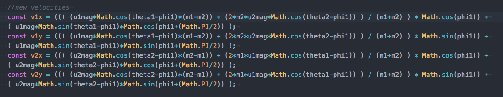
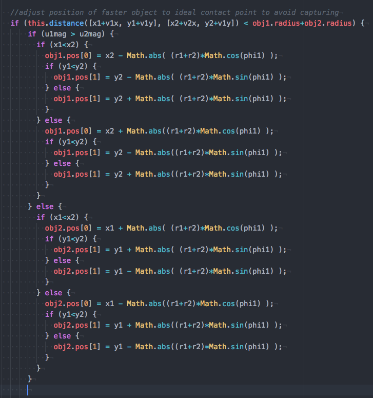
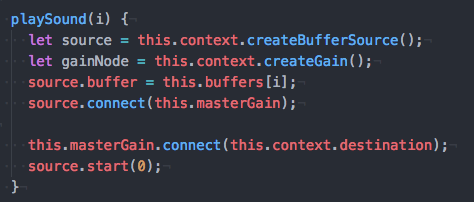

# StochAsteroids **Music Generator**

### Overview

StochAsteroids (Stochastic-Asteroids) combines the satisfying physics of joyfully bouncing asteroids with pleasant tones that evolve into calming soundscapes.

You can draw your own groups of asteroids, or randomly seed the stage. When you hit play, the asteroids will move and interact and produce **lovely music**.

### Technologies

- Vanilla `JavaScript` for overall structure and game logic,
- `HTML5 Canvas` for DOM manipulation and rendering,
- `Web Audio API` for sound generation, processing and control.

### Features

#### Bouncing happily!

<!--  -->

#### Random seed and drawing

### Select sound sets

### Physics

The asteroids have spherical mass, and collisions are resolved with momentum-conserving calculations.

I wrote my own collision detection, and collisions accurately reflect the point of contact.

I also had to write code to handle situations where the frame rate would place objects inside each other before the collision could be resolved.

### Evolutions

Behind the scenes, sounds are determined by the color of the colliding objects. I use Markov chains to govern the probabilities of sound and color events. Markov chains are constructed using matrices of probabilities that connect the input state to the output state.

For example, here is a diagram showing some probabilities for a red colliding object's next color:

### Sound

I implemented the `Web Audio API`. This involved constructing a global audio object, as well as functions for loading sound files into buffers from which they can be read. I dynamically create audio node objects when collision events are triggered and connect them to the Audio Graph.

## Future Directions

There are many directions in which this project could evolve.

- [ ] Allow the user to alter the Markov matrix governing color evolutions
- [ ] Allow the user to alter the matrix connecting color states to pitches
- [ ] Add recording and saving of output
- [ ] Allow users to import their own sounds
- [ ] Add more complex sound processing to the audio nodes, such as distortion and convolution
- [ ] Allow users to draw obstacles and restrictive spaces into the interaction environment

# Now you can go experience the relaxing  StochAsteroids
